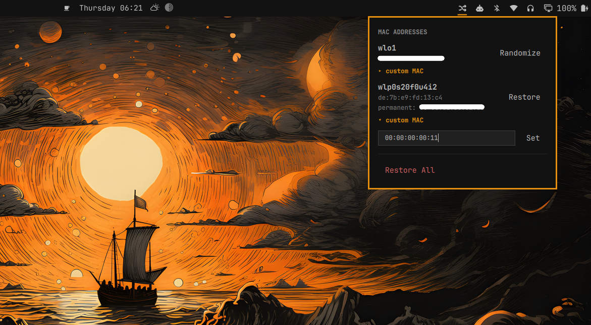

# Macarchy

A MAC-address toggle for the Omarchy bar. Click an interface, its MAC
randomizes. Click it again, it's back to the permanent one.

---

Needs Omarchy 4.x. Nothing else -- it uses `ip` from iproute2, which is
already on every Arch system.

## Install

```bash
omarchy plugin add https://github.com/SalimRK/macarchy.git --enable
```

That's it. There is no setup step: nothing is installed system-wide, no
polkit rule, no package, and none of the plugin's own code ever runs as
root.

## Privileges

Reading MAC state needs no privileges. How a change is made depends on
who manages the interface:

- **NetworkManager** (the usual case): Macarchy sets the active
  connection's `cloned-mac-address` and reconnects it, through NM's own
  permissions. No root and no password prompt. Restoring clears that
  setting again, back to NM's default.
- **Anything else**: exactly two commands run as root, both
  `/usr/bin/ip` from the signed iproute2 package with plain arguments:

  ```
  ip link set dev <iface> down
  ip link set dev <iface> address <mac> up
  ```

  From a bar click these go through `pkexec`'s stock admin action, so the
  polkit prompt shows the exact command before you approve it -- expect
  two prompts per change. From a terminal they go through `sudo`, which
  caches your password after the first one.

Never run `macarchy` itself with `sudo`; it refuses.

## Upgrading from 0.1.0

0.1.0 had a `setup` step that installed a copy of the script and a
passwordless polkit rule. Neither is used anymore; remove them with:

```bash
sudo rm -f /usr/local/bin/macarchy \
  /usr/share/polkit-1/actions/com.macarchy.policy \
  /etc/polkit-1/rules.d/49-macarchy.rules
```

`macchanger` is no longer needed either (`sudo pacman -Rns macchanger` if
nothing else uses it).

## Removing it

```bash
~/.config/omarchy/plugins/oniomarchy.macarchy/macarchy panic
omarchy plugin remove oniomarchy.macarchy
```

`panic` puts every interface back on its permanent MAC first, so you
aren't left on a randomized one.

## Panel

Click the icon to open the panel: one row per real network interface,
showing its current MAC (and the permanent one, once randomized), with a
Randomize/Restore button. Each row also has a collapsed "custom MAC"
link for setting a specific address instead of a random one. "Restore
All" appears once anything is randomized — the escape hatch if you lose
track of which interfaces you touched.

<p align="center">
  
</p>

## Commands

| | |
|---|---|
| `macarchy status [--json]` | Current state of every real interface. |
| `macarchy randomize <iface>` | Randomize one interface's MAC. |
| `macarchy restore <iface>` | Restore one interface's permanent MAC. |
| `macarchy set <iface> <mac>` | Set one interface to a specific MAC address. |
| `macarchy toggle <iface>` | Flip between randomized and permanent. |
| `macarchy panic` | Restore every interface at once. |

## What it costs

Changing a MAC address bounces the link, so expect a brief drop in
connectivity on that interface.

On a NetworkManager interface the randomized MAC is stored on that
connection's profile, so it sticks across reconnects to the same network
until you restore it. Randomize/Restore need the interface to be
connected, since that's how Macarchy finds the profile to change.

## Not yet built

- Randomize-on-connect (a persistent per-interface setting, rather than a
  manual click every time).
- Vendor/OUI display for the current MAC.
- Keyboard row-navigation inside the panel (mouse-only for now).

## License

MIT
